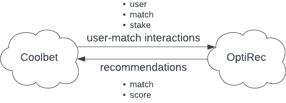

# OptiRec

## A Recommendation System for Sportsbook platforms

---

# Benefits

* Increase user engagement
* Increase user retention
* Increase user lifetime value
* Increase revenue

---

# Challenges

* Cold start        <!-- What to recommend to new users, with no history -->
* Novelty           <!-- User was not aware of the item before -->
* Serendipity       <!-- Surprise/unexpectedness in recommendations -->
* Diversity         <!-- Different leagues/regions/sports -->
* Robustness        <!-- How much is the model affected by fake ratings -->
* Scalability       <!-- How much data can the model handle -->

---

# How it works?

---

# Models

## Popularity-based recommendations

Which matches are popular based on the number of unique users?

## Turnover-based recommendations

Which matches have the highest turnover?

---

# Models

## Collaborative filtering

Which matches are attractive to users similar to me?

---

# Models

## Content-based recommendations

Which matches have the most similar features to the ones I like?

<!--
Knowledge-based recommendations 

Introduce location-, context- and time-awareness
-->

---

# Models

## Association pattern mining

Which matches or markets are often selected together?

---

# Evaluation

## Ranking

* Hit rate
* Mean average precision
* Mean repricoral rank

---

# Competitors

## Recombee

Focus on e-commerce

## Google Cloud Recommendations AI

## Amazon Personalize

---

# Pricing

## Usage-based, **per recommender**

* 2 000 000 requests per month
* 1 000 000 users

## Cost **per recommender**

<!-- 2 000 000 interactions -->
* Recombee - 899$ / month

<!-- 0.375 + 9 * 0.045 * 24 * 30 + (0.0833 / 1000) * 2000000 = 458,575 + storage -->
* Amazon personalize - 458.58$ / month

<!-- (0.27 / 1000) * 2 000 000 -->
* Google Recommendation AI - 540$ / month

<!-- (0.1 / 1000) * 2 000 000 -->
* OptiRec - 200€ / month

---

# Demo
